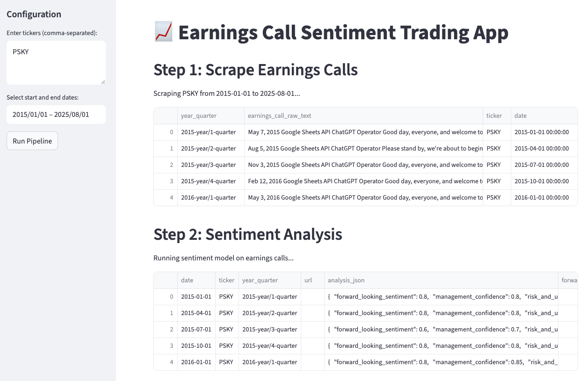
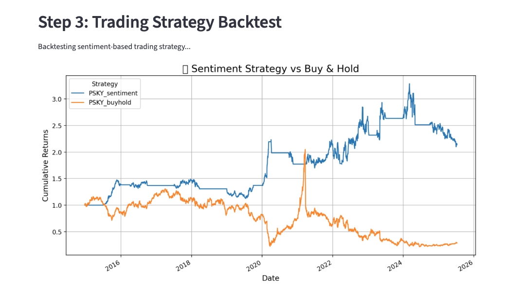

# Earnings Call Sentiment Strategy Backtester

This project provides a backtesting framework to evaluate trading strategies based on sentiment extracted from earnings call transcripts. The app uses a combination of sentiment scores across multiple dimensions and compares strategy performance against a buy-and-hold baseline.

## Features

- Processes earnings call sentiment data per stock
- Computes z-score-based signals from sentiment trends
- Applies position sizing and stop loss/take profit logic
- Backtests performance over time
- Displays results in an interactive Streamlit dashboard
- Compares strategy vs. buy-and-hold curves
- Supports multiple stocks and strategies in parallel

## Setup & Installation

### 1. Clone the repository

```bash
git clone https://github.com/yourusername/earnings-call-sentiment-backtest.git
cd earnings-call-sentiment-backtest
```

### 2. Create and activate a Python environment

You can use `venv` or `conda`. Example with `venv`:

```bash
python3 -m venv env
source env/bin/activate
```

### 3. Install dependencies

```bash
pip install -r requirements.txt
```

### 4. Set environment variables and run the app

The script `set_env.sh` can be used to configure environment variables (e.g., API keys, if needed).

```bash
chmod +x set_env.sh
source set_env.sh
streamlit run src/app.py
```

This will launch a browser window where you can interact with the app.

## Example UI

| Scraping + Sentiment Analysis | Backtest |
|-------------------------|----------------------------|
|  | 

## Results
The results vary depending on:
- Sentiment thresholds
- Which sentiment features are used
- Risk management settings (stop loss / take profit)
- Sector or market regime

Some strategies outperform the benchmark significantly, while others underperform, especially in volatile or sentiment-agnostic environments.

## Future Work

Planned improvements include:

- UI elements to adjust backtesting parameters interactively (e.g., stop loss %, z-score thresholds, position size)
- Store and visualize trade-level statistics (hit rate, avg win/loss, drawdowns)

## Acknowledgements

This project combines tools from:

- [Pandas](https://pandas.pydata.org/)
- [Matplotlib](https://matplotlib.org/)
- [yFinance](https://pypi.org/project/yfinance/)
- [Streamlit](https://streamlit.io/)
- [FFN / bt](https://pmorissette.github.io/bt/)

---

Feel free to open issues or submit PRs for suggestions and improvements!

```
